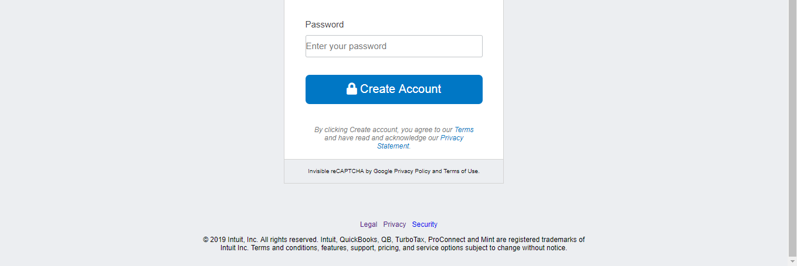

# html_forms

This is the second project of the Main HTML/CSS curriculum at [Microverse](https://www.microverse.org/) - @microverseinc
* The goal was to recreate Mint.com's sign up page
* The project was completed using simple html and css 

#### [Assignment link](https://www.theodinproject.com/courses/html5-and-css3/lessons/html-forms)

#### Screenshots

* 
* 

#### Authors

* [@Flover](https://github.com/flov3rh)
* [@Gus](https://github.com/gustavocesena/)
